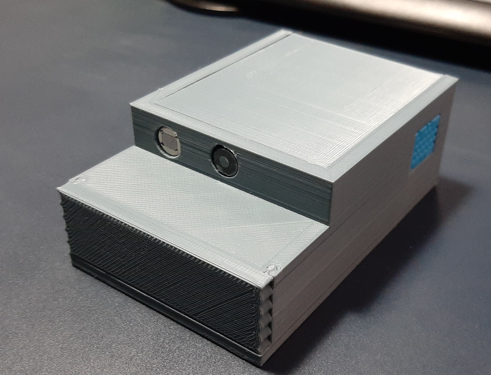
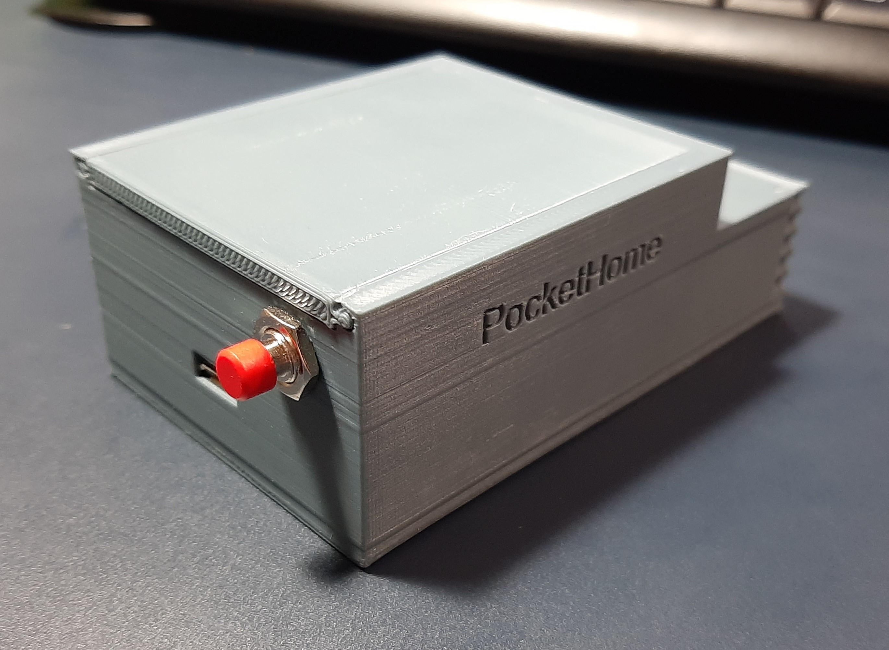
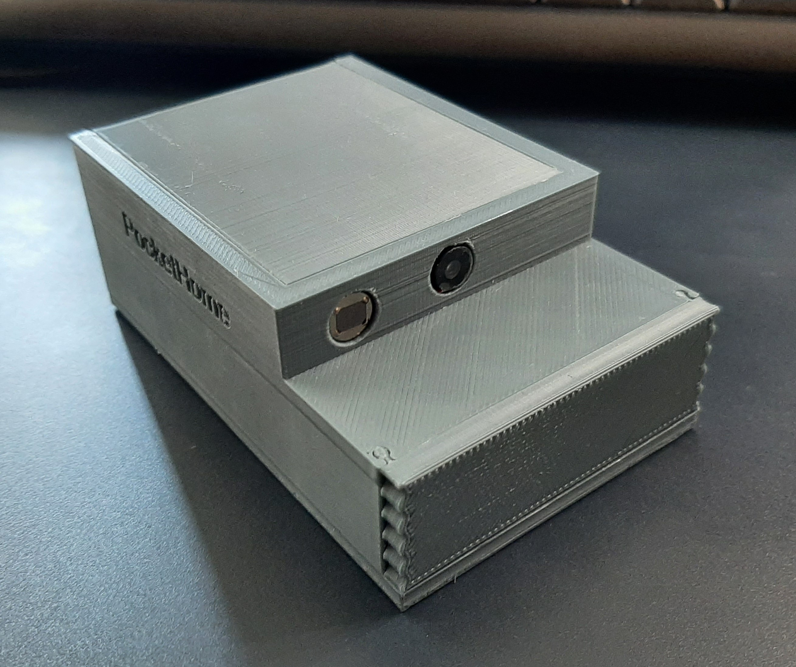
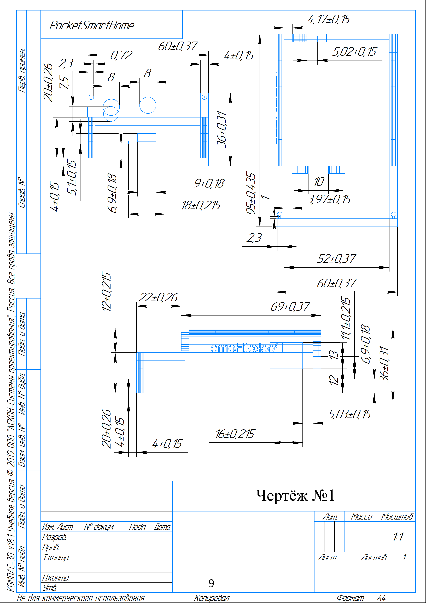
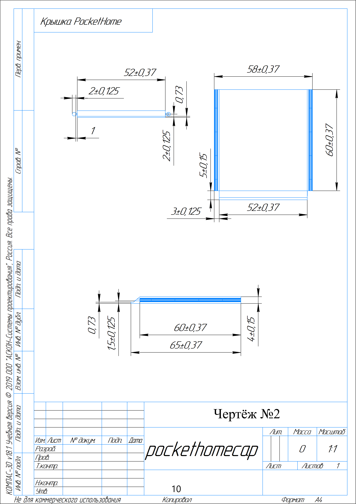
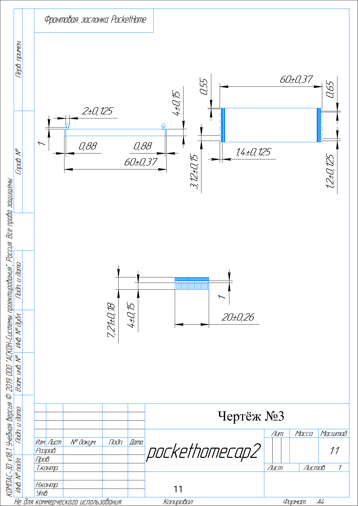

# PocketSmartHome (Portable IoT Surveillance & Climate Monitor)
Pocket Smart Home is a compact, battery-powered, and fully portable IoT solution designed for people who frequently move or travel. It provides an all-in-one, budget-friendly smart home experience without the need for complex installations.

🏆 **This project won the regional stage of the All-Russian Olympiad for Schoolchildren (Moscow Region).**

<table>
  <tr>
    <td></td>
    <td></td>
    <td></td>
    <td></td>
    <td></td>
    <td></td>
  </tr>
</table>

## Key Features

*   **Live Video Surveillance:** Real-time HTTP video streaming via ESP32-CAM.
*   **Climate Monitoring:** Tracks room temperature and humidity (DHT11 sensor).
*   **Security & Intrusion Detection:** Motion detection alerts pushed directly to a smartphone via PIR sensor.
*   **True Portability:** Powered by an integrated 4100mAh Li-ion battery with a TP4056 charging module.
*   **Smart Integration:** Fully compatible with **Home Assistant** via ESPHome firmware.
*   **Custom 3D Printed Enclosure:** A modular, cube-like design printed in eco-friendly PLA plastic for durability and easy transport.

## Hardware Components

The device was engineered to be highly cost-effective (total component cost ~$15-20) while maintaining robust functionality:

*   **Microcontroller:** ESP32-CAM (AI Thinker model)
*   **Sensors:** PIR-SB312 (Motion), DHT11 (Temperature & Humidity)
*   **Power Supply:** 4100mAh Li-ion Battery + TP4056 Charge Module + SCV0042-3.3v-0.9A Voltage Regulator
*   **Case:** Custom designed in CAD and 3D printed (PLA)

## Software Stack & Code Structure

The repository contains the custom C++ firmware for the ESP32 microcontroller. 
*   **esp32_cam_stream.ino:** Handles the camera initialization, Wi-Fi connection, and runs an asynchronous HTTP server on port 80 to broadcast multipart JPEG frames.
*   **Memory Management:** Automatically detects available PSRAM to allocate frame buffers (UXGA for PSRAM, SVGA without it) to prevent heap exhaustion.
*   **Stability:** Includes hardware-level configurations to disable brownout detectors during power spikes.

## How to Run

1. Open the project in the Arduino IDE.
2. Install the ESP32 Board Manager and select `AI Thinker ESP32-CAM`.
3. In the code, update your network credentials:
   ```cpp
   const char* ssid = "WIFI_SSID";
   const char* password = "WIFI_PASSWORD";
4. Flash the code using an FTDI / TTL programmer.
5. Open the Serial Monitor (115200 baud) to find the local IP address.
6. Navigate to http://<YOUR_ESP32_IP> in any web browser to view the live feed.

## Home Assistant Integration

Pocket Smart Home can be fully integrated into the Home Assistant ecosystem and managed via the official mobile app.

* **Sensors & Firmware:** The DHT11 temperature/humidity sensor and PIR motion detector are configured using the ESPHome platform for seamless communication with the smart home server.
* **Camera Feed:** The live HTTP video stream can be added to the Home Assistant dashboard by configuring a Generic Camera integration pointing to http://<YOUR_ESP32_IP>.
* **Mobile Access:** Once deployed on a local server, all sensor data, motion alerts, and the live camera feed are accessible remotely through the Home Assistant mobile application.

## Documentation

For a deep dive into the engineering process, including 3D model blueprints, electrical schematics, component justification, and Home Assistant setup, please refer to the explanatory note (in Russian):
PocketSmartHome_Engineering_Notes_RU.pdf

A presentation of the work's defense at the final stage of the Olympiad is also available. [Presentation](https://docs.google.com/presentation/d/1gnX3RPoxm2LvydJuK4Y2AMV-k92565f06SBdwamBD_s/edit?usp=sharing)
